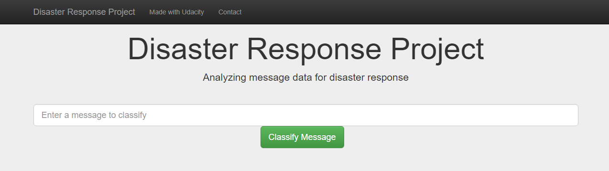
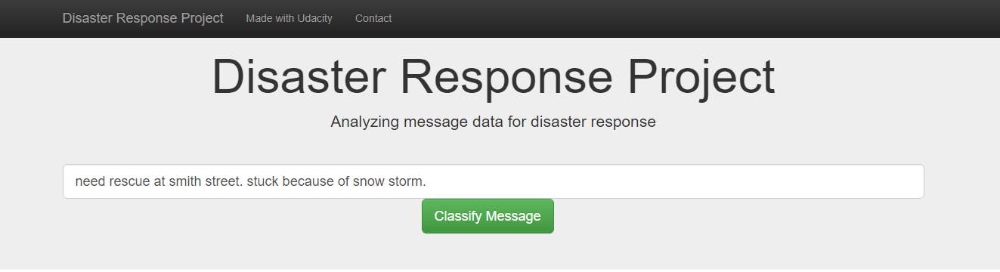
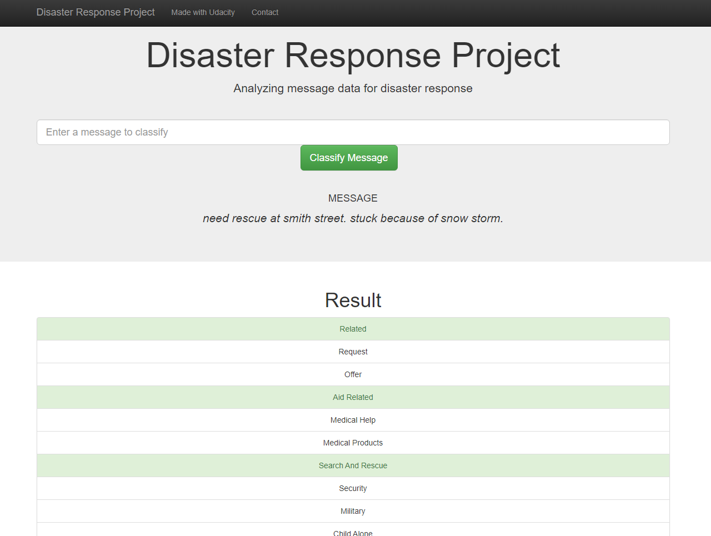
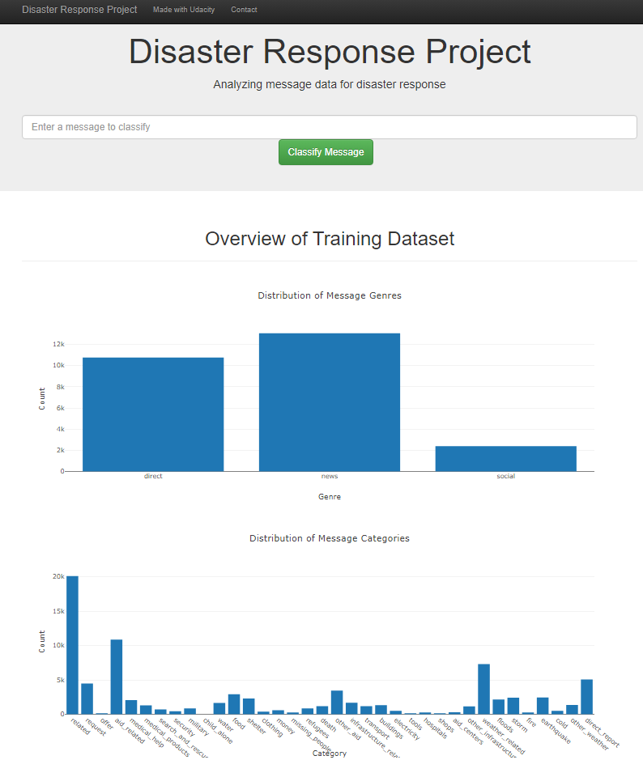

# Disaster Response Pipeline Project




## Table of Contents
1. [Description](#description)
2. [Getting Started](#getting_started)
	1. [Dependencies](#dependencies)
	2. [Installing](#installation)
	3. [Executing Program](#execution)
	4. [Additional Material](#material)
3. [Authors](#authors)
4. [License](#license)
5. [Acknowledgement](#acknowledgement)
6. [Screenshots](#screenshots)
7. [Ideas to Improve](#ideas)

<a name="descripton"></a>
## Description

This Project is in collaboration with Figure Eight. The dataset contains pre-labeled tweets and messages from real-life disaster events. The project's aim is to build a Natural Language Processing (NLP) model to categorize messages on a real-time basis.

The web app (embedded with a machine learning pipeline) lets an emergency worker input a new message and displays categorized events so that you can send the messages to an appropriate disaster relief agency.

This project is divided into the following key sections:

1. Processing data, building an ETL pipeline to extract data from the source, cleaning the data, and saving them in a SQLite DB.
2. Build a machine learning pipeline to train which can classify text messages into various categories.
3. Run a web app showing model results in real-time.

<a name="getting_started"></a>
## Getting Started

<a name="dependencies"></a>
### Dependencies
* Python 3.7+
* Machine Learning Libraries: NumPy, SciPy, Pandas, Sciki-Learn
* Natural Language Process Libraries: NLTK
* SQLlite Database Libraries: SQLalchemy
* Model Loading and Saving Library: Pickle
* Web App and Data Visualization: Flask, Plotly

<a name="installation"></a>
### Installing
To clone the git repository:
```
git clone https://github.com/anudeepvanjavakam1/disaster_response_NLP.git
```
<a name="execution"></a>
### Executing Program:
1. You can run the following commands in the project's directory to set up the database, train and save the model.

    - To run the ETL pipeline to clean data and store the processed data in the database
        `python data/process_data.py data/disaster_messages.csv data/disaster_categories.csv data/disaster_response.db`
    - To run the ML pipeline that loads data from DB, trains the classifier, and saves the classifier as a pickle file
        `python models/train_classifier.py data/disaster_response.db models/disaster_response_cv_classifier.pkl`

2. Run the following command in the app's directory to run your web app.
    `python run.py`

3. Enter the http address displayed in the terminal in a browser to see the app.

<a name="material"></a>
### Additional Material

In the **data** and **models** folder you can find two Jupyter notebooks that will help you understand how the model works step by step:
1. **ETL Preparation Notebook**: learn everything about the implemented ETL pipeline.
2. **ML Pipeline Preparation Notebook**: look at the Machine Learning Pipeline developed with NLTK and Scikit-Learn.

You can use **ML Pipeline Preparation Notebook** to re-train the model or tune it through a dedicated Grid Search section.

<a name="importantfiles"></a>
### Important Files
**app/templates/***: templates/html files for web app

**data/process_data.py**: Extract Transform Load (ETL) pipeline used for data cleaning, feature extraction, and storing data in a SQLite database.

**models/train_classifier.py**: A machine learning pipeline that loads data, trains a model, and saves the trained model as a .pkl file for predicting a live message later.

**run.py**: This file can be used to launch the Flask web app used to classify disaster messages.

<a name="authors"></a>
## Authors

* [Anudeep Vanjavakam](https://github.com/anudeepvanjavakam1)

<a name="license"></a>
## License
[](https://opensource.org/licenses/MIT)

<a name="acknowledgement"></a>
## Acknowledgements

* [Udacity](https://www.udacity.com/) for providing an amazing Data Science Nanodegree Program
* [Figure Eight](https://www.figure-eight.com/) for providing the relevant dataset to train the model

<a name="screenshots"></a>
## Screenshots

1. This is an example of a message we can type to test the performance of the model.



2. After clicking **Classify Message**, we can see the categories to which the message belongs highlighted in green.



3. The main page shows some graphs about the training dataset. The dataset is provided by Figure Eight.



<a name="Ideas"></a>
## Ideas to Improve

In this dataset, there are 36 categories (output classes) that have different numbers of samples and they are imbalanced. For example, the related category has the most no. of samples (> 5000) while the missing_people category has only 68 samples. This affects the performance of the model as it tries to assign 'related' category to a live message more frequently than a true category that is useful.

**Approaches to improve the model or deal with the imbalanced classes:**

 - **Gathering more data** for categories that have extremely few samples by scraping more data or by working with more agencies to share real-life messages.
 
 - **Oversampling:** Oversampling to replicate minority class instances randomly may overfit and lead to inaccurate predictions on test data. Another advanced technique is SMOTE which generates synthetic samples by taking each minority class sample and introducing synthetic examples along the line segments joining any/all of the k minority class nearest neighbors. Unfortunately, this technique doesn’t work well with text data because the numerical vectors that are created from the text are very high dimensional.
 
 - **Merging minority classes:** This dataset has multiple classes that have overlapping features. It may be better to merge these multiple minority classes (reducing imbalance) to improve the model performance but this may offer only marginal gains as minority classes have extremely few samples. For example, 1. weather-related and other weather categories, 2. medical help, medical products, and hospitals

- **Data Augmentation:** For text, data augmentation can be done by tokenizing a document into a sentence, shuffling and rejoining them to generate new texts, or replacing adjectives, verbs, etc by a synonym to generate different text with the same meaning. Any pre-trained word embedding or NLTK’s wordnet can be used to find the synonym of a word. One of the ways to achieve this is with Google Translation(google trans python package). This is one of the useful techniques to expand the count of minority groups. Here, we translate the given sentence to ‘non-English’ language and then again translate to ‘English’. In this way, the significant details of the input message are maintained but the order of words / sometimes new words with similar meaning are introduced as a new record and thus boosting the count of insufficient class.

- **Class weights:** This method leverages the class weights parameter during the fit model process. For each class in the target, a weightage is assigned. The minority class will get more weightage when compared to the majority ones. As a result, during the backpropagation, more loss value is associated with the minority class and the model will give equal attention to all the classes present in the output. We would have to re-train the model with an algorithm such as SVM that supports the class_weight = 'balanced' parameter.
